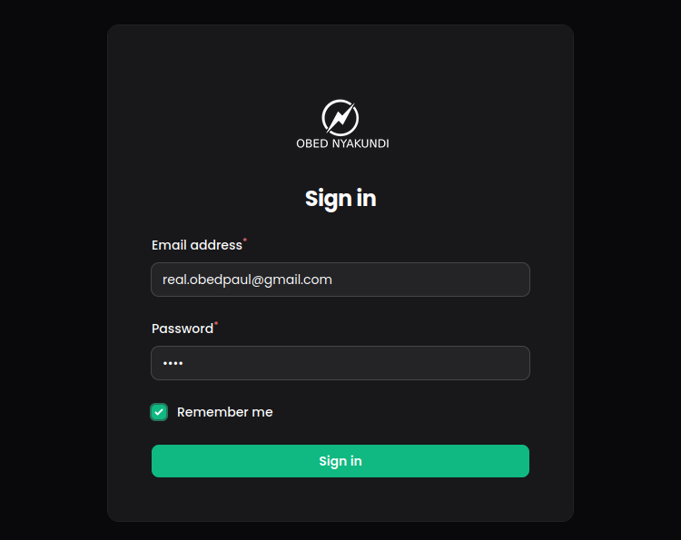
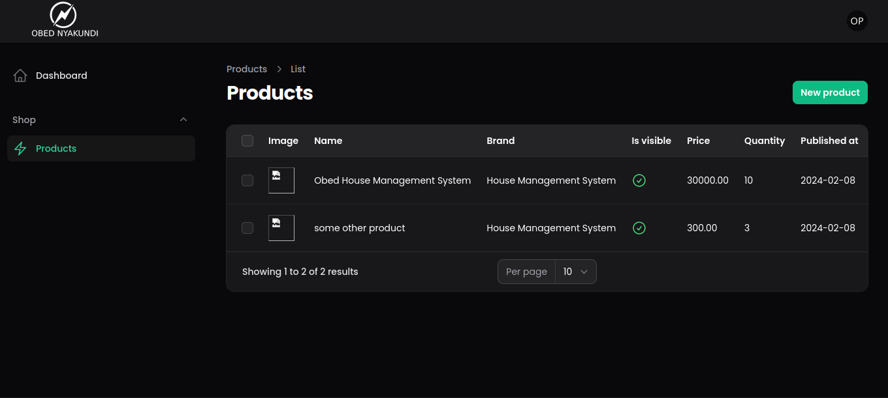
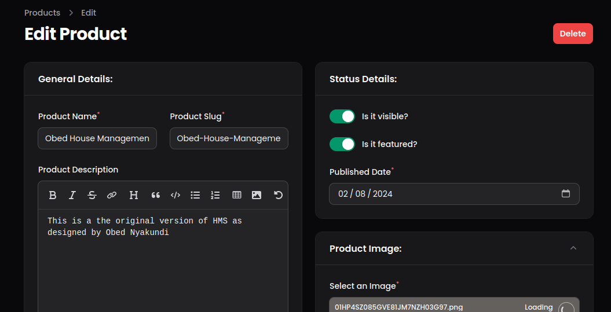

## About This Repository

In this repository I was learning to use Filament V3 in the development of an Admin Dashboard.

Here are the features as I will keep updating them.

## The Login Page
This often comes already created by Filament. After DB migrations, you will need to run the command

`php artisan make:filament-user` 

to add a new user. 

Lastly, modify the Logo by overriding the default Filament Logo under 

`resources\views\vendor\filament-panels\components\logo.blade.php`

The resulting login will be as below:

## Learning to Create a Resource

Simply type the command 

`php artisan make:filament-resource ResourceName`

Ensure to use the same name for the resource as the name of the Model. e.g. after creating a resource for products, here are images of the table and the form.

Filament comes with all the CRUD operations and resource modifiers pre-developed. You only chain  the functions to implement the operations as illustrated within the code.

### Product Resource Table

### Product Resource Form

